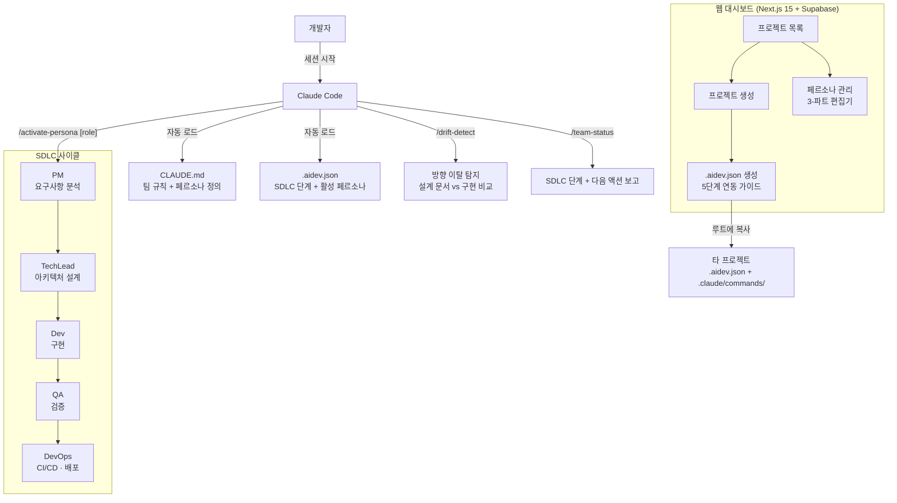

# AI Dev Team

> Claude Code 기반 페르소나 개발팀 프레임워크 — 역할 강제 + 방향 이탈 감지 + 웹 대시보드

## 개요

AI(Claude Code)와 협업할 때 발생하는 세 가지 문제를 구조적으로 해결합니다:

| 문제 | 해결 방법 |
|------|----------|
| 역할 혼재 | PM/TechLead/Dev/QA/DevOps 페르소나 + GUARD 규칙 |
| 방향 이탈 | 설계 문서 없는 구현 시도 시 자동 경고 |
| 컨텍스트 손실 | `.aidev.json` 한 파일로 팀 규칙 이식 |

---

## 빠른 시작 (5분 연동)

### 1. 신규 프로젝트에 적용

```bash
# 1. 웹 대시보드에서 프로젝트 생성 → .aidev.json 다운로드
# 2. 대상 프로젝트 루트에 파일 복사
cp .aidev.json /path/to/your-project/
cp -r .claude/ /path/to/your-project/

# 3. 대상 프로젝트 CLAUDE.md 최상단에 추가
cat >> /path/to/your-project/CLAUDE.md << 'EOF'
# AI Dev Team Framework
이 프로젝트는 ai-dev-team 프레임워크를 사용합니다.
세션 시작 시 .aidev.json을 읽어 팀 페르소나와 워크플로우 규칙을 적용합니다.
규칙: 설계 없는 구현 금지 / 역할 이탈 시 담당 페르소나에게 위임
커맨드: /activate-persona [role] | /team-status | /drift-detect
EOF

# 4. Claude Code 세션 시작 후 역할 선택
/activate-persona dev
```

### 2. 기존 프로젝트 참여

```bash
/team-status         # 현재 SDLC 단계 확인
/activate-persona pm  # 담당 페르소나 활성화
```

---

## 페르소나 (역할)

| 역할 | 담당 | SDLC 단계 |
|------|------|----------|
| `pm` | 요구사항 분석, PRD, 우선순위 | Plan |
| `techlead` | 아키텍처 설계, 기술 결정, 코드 리뷰 | Design |
| `dev` | 설계 기반 구현, 기술 문제 해결 | Implement |
| `qa` | 테스트 전략, 버그 탐지, 배포 승인 | Verify |
| `devops` | CI/CD, 환경 설정, 배포, 모니터링 | Deploy/Maintain |

각 페르소나는 **3-파트 시스템 프롬프트**로 정의됩니다:
- **ROLE**: 역할 선언 (나는 누구인가)
- **SCOPE**: 담당 범위 (내가 할 수 있는 것)
- **GUARD**: 역할 가드 (내가 하지 않는 것 + 위임 대상)

---

## 커맨드

| 커맨드 | 설명 |
|--------|------|
| `/activate-persona [role]` | 페르소나 전환 (pm/techlead/dev/qa/devops) |
| `/team-status` | 현재 SDLC 단계 & 다음 액션 확인 |
| `/drift-detect` | 구현이 설계에서 이탈했는지 점검 |
| `/generate-config [name]` | 현재 프로젝트 `.aidev.json` 생성 |

---

## 웹 대시보드

Next.js 15 + Supabase 기반 관리 인터페이스.

### 로컬 실행

```bash
# 1. Supabase 프로젝트 생성: https://supabase.com → New project
# 2. SQL Editor에서 web/supabase/schema.sql 실행
cd web
cp .env.example .env.local
# .env.local에 Supabase 자격증명 입력
npm install
npm run dev
```

### 환경 변수

```env
# Settings → API → Project URL
NEXT_PUBLIC_SUPABASE_URL=https://your-project-id.supabase.co

# Settings → API → service_role 키 (서버 사이드 전용)
SUPABASE_SERVICE_ROLE_KEY=your-service-role-key-here

NEXT_PUBLIC_APP_URL=http://localhost:3000
```

### 주요 페이지

| 페이지 | 설명 |
|--------|------|
| `/` | 대시보드 — 프로젝트 목록 + SDLC 현황 |
| `/projects/new` | 프로젝트 생성 |
| `/projects/[id]` | 프로젝트 상세 + SDLC 단계 관리 + 페르소나 토글 |
| `/projects/[id]/connect` | `.aidev.json` 생성 & 다운로드 + 5단계 연동 가이드 |
| `/personas` | 페르소나 관리 |
| `/personas/new` | 커스텀 페르소나 생성 (3-파트 편집기) |

---

## `.aidev.json` 스키마

```json
{
  "version": "1.0",
  "team": "ai-dev-team",
  "generatedAt": "2026-05-21T00:00:00Z",
  "project": {
    "id": "proj_xxx",
    "name": "my-project",
    "description": "...",
    "sdlcPhase": "design",
    "gitUrl": "https://github.com/user/repo"
  },
  "personas": [
    {
      "role": "dev",
      "active": true,
      "displayName": "Senior Developer",
      "systemPrompt": "ROLE: ...\n\nSCOPE: ...\n\nGUARD: ...",
      "canDo": ["설계 기반 구현", "기술 문제 해결"],
      "cannotDo": ["아키텍처 결정", "배포"],
      "delegateTo": "techlead"
    }
  ],
  "rules": {
    "requireDesignBeforeImplement": true,
    "driftDetection": true,
    "roleEnforcement": true,
    "handoffChecklist": true
  }
}
```

---

## 문제 → 선택 → 결과

**문제.** Claude Code로 혼자 개발하면 AI가 PM·설계·구현·검증을 동시에 담당하면서 역할 경계가 허물어진다. "설계 없는 구현"이 반복되고, 맥락이 길어질수록 초기 결정에서 조용히 이탈한다.

**선택.** 역할을 강제하는 구조를 만들었다. CLAUDE.md에 PM/TechLead/Dev/QA/DevOps 5개 페르소나를 정의하고, `.aidev.json` 한 파일로 다른 프로젝트에 이식한다. 웹 대시보드에서 프로젝트를 생성하면 `.aidev.json`을 자동 생성해 5분 안에 연동 가능하다.

**결과.** 각 SDLC 단계가 명확한 담당 페르소나로 분리된다. `/drift-detect`로 구현이 설계에서 이탈했는지 즉시 감지한다. 새 프로젝트 적용은 CLAUDE.md 한 줄 추가 + `.aidev.json` 복사로 완료된다.

---

## 아키텍처



---

## 기술 스택 & 선택 이유

| 기술 | 선택 이유 |
|------|-----------|
| **Claude Code CLAUDE.md** | AI 세션마다 자동 로드되는 컨텍스트 주입 지점. 페르소나 정의를 여기에 두면 별도 설정 없이 모든 세션에 적용된다 |
| **`.aidev.json`** | 팀 규칙을 한 파일로 캡슐화. 다른 프로젝트 루트에 복사만 하면 이식 완료. CLAUDE.md 수정 없이 프로젝트별 설정 분리 가능 |
| **CC Slash Commands** | `/activate-persona`, `/drift-detect` 같은 워크플로우 액션을 명령어로 표준화. 개발자가 단계 전환을 명시적으로 제어 |
| **Next.js 15 + Turbopack** | 웹 대시보드. App Router 서버 컴포넌트로 Supabase 직접 조회, API 레이어 불필요 |
| **Supabase** | 프로젝트·페르소나 데이터 저장. PostgreSQL + Auth 무료 티어로 운영. `.aidev.json` 생성 로직의 데이터 소스 |

---

## 프로젝트 구조

```
ai-dev-team/
├── CLAUDE.md              ← 팀 규칙 + 페르소나 정의 (CC Native)
├── .claude/
│   ├── settings.json      ← 훅 + 권한 설정
│   └── commands/          ← CC 커맨드
│       ├── activate-persona.md
│       ├── team-status.md
│       ├── drift-detect.md
│       └── generate-config.md
├── .aidev.json            ← 연동 config (웹 대시보드가 생성)
├── docs/
│   └── personas/          ← 페르소나 상세 정의
└── web/                   ← Next.js 15 대시보드
    ├── app/               ← App Router 페이지
    ├── components/        ← UI 컴포넌트
    ├── lib/               ← 비즈니스 로직
    └── types/             ← TypeScript 타입
```

---

## 요구사항

- Claude Code v2.1.71+
- Node.js 18+
- Supabase 계정 (웹 대시보드 사용 시, 무료 플랜 충분)

---

## 라이선스

MIT
